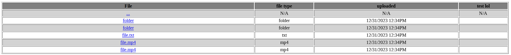

# Files2Table
File tree to html pages displayed with tables

...at least that's the idea, idk if this will be efficient or pointless, but it sounds good in my head. 

the idea behind this is making a file tree using html tables for a potential archive site. i know there's already stuff for "archive sites" but eh why not make my own.

Concept Image:

Update 0.1: Read Files
okay readfiles.py can now list files and folders in a directory along with there sizes. a good start i suppose